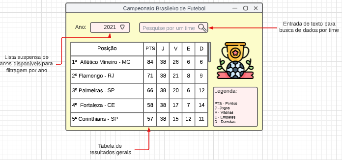

# Tema do Projeto

Apresentação dos dados do Campeonato Brasileiro de Futebol.

## Dupla

Déborah Abreu Sales - 20210006075

Isac Kaik Oliveira Santos - 202100115453

## Tela da Aplicação

## Descrição do Aplicativo

- O usuário seleciona o ano em que ele quer os dados do campeonato. 
- Após selecionado, a aplicação carrega os dados na tela em forma de tabela, ilustrando o ranking, pontuação e dados dos jogos.
- No canto superior esquerdo, possui uma lista suspensa para o usuário transitar entre os resultados em um determinado ano.
- Na parte superior central, um campo de busca em que o usuário pesquisará por um clube específico.
  - Quando o usuário escolhe um clube corretamente, é exibido um gráfico de desempenho do clube selecionado.
- Ao lado inferior direito, uma legenda auxiliando na descrição das colunas da tabela.

